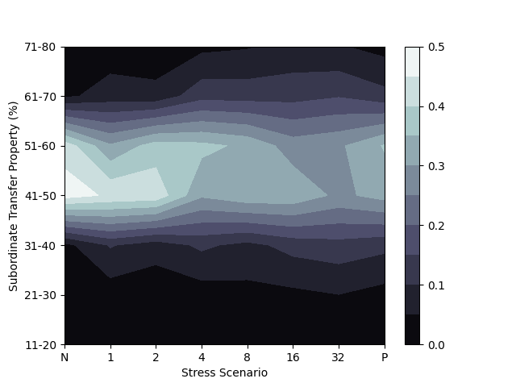
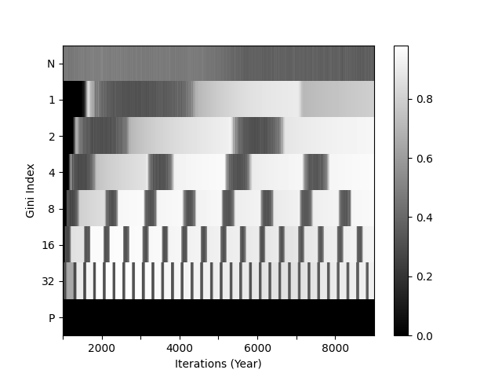

# NeoCOOP: Neolithic Agent Cooperation Model
NeoCOOP is an agent-based model (ABM) designed to simulate the emergence and evolution of altruistic and selfish 
behaviour in Neolithic Households under varying degrees of environmental stress.

An ODD+D [[Müller et al., 2013]](https://www.sciencedirect.com/science/article/pii/S1364815213001394) 
description plus additional model details have been included 
in [Supplementary Materials.pdf](./Supplementary%20Materials.pdf). Specific versions of
NeoCOOP can be found under releases and all old supplementary materials (which may be more
relevant to you) can be found under [resources](./resources/OLD%20Supplementary%20Materials).


## Installation

**Note:** This document assumes you are using a UNIX-based OS.

**Note:** Please make sure that you are using a version of `ECAgent < 0.5.0`

To use NeoCOOP, first clone the repo and navigate to the *NeoCOOP/* directory using your favourite terminal application.
We first need to create a virtual environment for NeoCOOP and we do so by typing:

`> make`

into your terminal. That should create a virtual environment with all the necessary modules needed to run NeoCOOP.
Next activate the virtual environment by typing:

`> source ./venv/bin/activate`

Once that is complete we can compile the Cython code used in NeoCOOP with:

`> make compile`

This will create several *.so* files that NeoCOOP will make use of.

## Running a Single Simulation:

To run an instance of NeoCOOP, first make sure you have installed all the necessary modules and have the virtual environment activated.

Run a single instance of NeoCOOP by typing the following into your terminal:

`> python3 src/main.py -f path/to/decoder [-lrb basename] [--frequency n]`

- *-f* specifies the path to the decoder folder used to customize the initial parameters of NeoCOOP. Several have already been provided under `/resources`
- *-l* specifies that you would like to log all System Actions to a file called: *events.log*
- *-r* specifies that you would like record snapshots of the environment, settlements and agents
- *-b* specifies the base folder name of the recorded snapshots. The default value is: *base*
- *--frequency* specifies the frequency at which snapshots are recorded. The default value is: 1

## Visualizing a Single Simulation:

To visualize a recorded simulation, use the following command:

`> python3 ./src/main_vis.py ./path/to/base/file 100 100`

where the base file is the directory generated by running the simulation.

**Note:** This process may take a while as a variety of plots and gifs are created.

## Running Multiple Simulations at Once:

To run multiple simulations at once, run the following command:

`> ./batchrunner.sh ./path/to/decoder/ /path/to/output/folder`

The first argument is the same as the *-f* argument when running a single simulation and the second argument
should be an empty directory where all the simulations will record their data to (Arranged by seed value).

Note: You can add / remove any seeds from the seed list as well as modify the number of
simulations that can run at any one time (Look inside *batchrunner.sh*)

## Processing Batch Simulations:

To process batch simulations, run the following:

`> python3 src/collected_data_processor.py -p paths -o output_folder`

This will create a series of JSON files will all of a batch simulations useful information.

If the size of the generated simulation data cannot be processed by your machine, you can process and stitch the data
using:

```bash
> python3 src/scenario_data_processor.py -p path -o output_folder
```

and

```bash
> python3 src/scenario_stitcher.py -p path -o output_file -s file_suffix
```

**Note:** The output folder `-o` of `scenario_data_processor.py` and the input path `-p` of `scenario_stitcher.py` should
be the same value. `scenario_data_processor.py` processed the data produced by a scenario and `scenario_stitcher.py` 
combines it together to get to match the output produced by `collected_data_processor.py`.

## Plotting Graphs:

While the data processed by `collected_data_processor.py` can be used to create plots of your liking,
we do include a script `graph_plotter.py` that will produce a wide variety of graphs of interest:

`> python3 src/graph_plotter.py -p path_to_processed_data -o output_folder -s none`

This will produce graphs of agent resource trading beliefs, population levels, inequality, and settlement density:

Agent Populations:


Resource Trading Beliefs:




Gini Heatmap:



Settlement Density:


Another look at the final Resource Trading Beliefs for one scenario:


## Work Published using NeoCOOP

```
Brandon Gower-Winter and Geoff Nitschke. Do harsher environments cause selfish or altruistic behavior? 
In Genetic and Evolutionary Computation Conference Companion (GECCO ’22 Companion)), July 2022.
Available here: http://www.nitschke-lab.uct.ac.za/sites/default/files/image_tool/images/540/Papers/
2022-Do%20Harsher%20Environments%20cause%20Selfish%20or%20Altruistic%20Behavior.pdf
```

```
Brandon Gower-Winter and Geoff Nitschke. Societies prefer the middle-ground between selfishness and 
cooperation. In 4th International Workshop on Agent-Based Modelling of Human Behaviour (ABMHuB’22), 
2022.  Available here: http://abmhub.cs.ucl.ac.uk/2022/camera_ready/Gower-Winter_Nitschke.pdf
```

```
Brandon Gower-Winter and Geoff Nitschke. Extreme Environments Perpetuate Cooperation. In IEEE Symposium Series On 
Computational Intelligence (SSCI’22) Available here: https://pubs.cs.uct.ac.za/id/eprint/1540/1/
2022-Extreme%20Environments%20Perpetuate%20Cooperation.pdf
```

```
Brandon Gower-Winter. Self-Adapting Simulated Artificial Societies. Masters Dissertation. University of Cape Town (2022)
Available here: http://www.nitschke-lab.uct.ac.za/sites/default/files/image_tool/images/540/Papers/
2022-Self-Adapting%20Simulated%20Artificial%20Societies.pdf
```